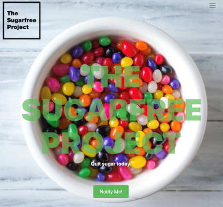

<h1 align="center">
   
  TheSugarFreeProject
   
   
  
   
</h1>

<h4 align="center">
  這是一個幫助糖分成癮患者逐日減少糖分攝取，控制健康的APP
    
  Made with React Native.
</h4>

 
 

 
 

## Introduction
1. 藉由使用者輸入每天攝取的糖分，可以計算出應攝取的糖分。
2. 有最近攝取的飲料歷史紀錄，方便記錄。
3. 會根據最近幾周所攝取的糖分畫出圖表，方便追蹤或更改飲食習慣。

##  Features that will be added in the future
1. 我們希望使用者能使用手機刷取飲料上的條碼來獲取飲料糖分資訊，以方便使用。
2. 經由調查發現女性較有健康管理、瘦身上的需求，美化UX/UI，使設計貼近女性。

## How to use

Run `npm install`.

 
